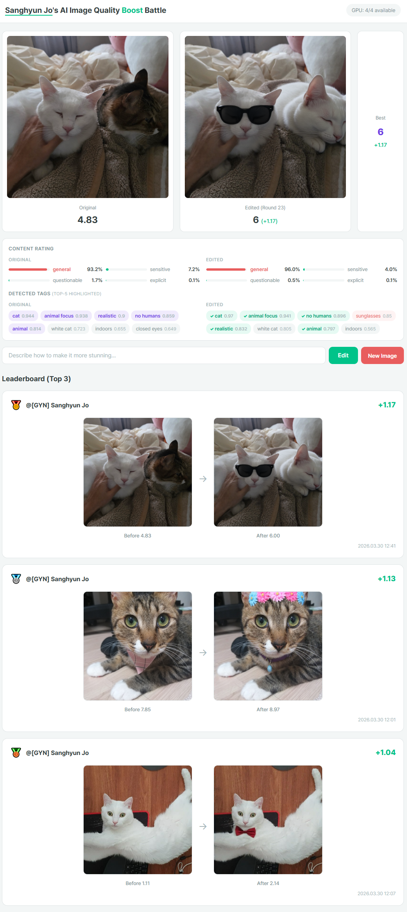
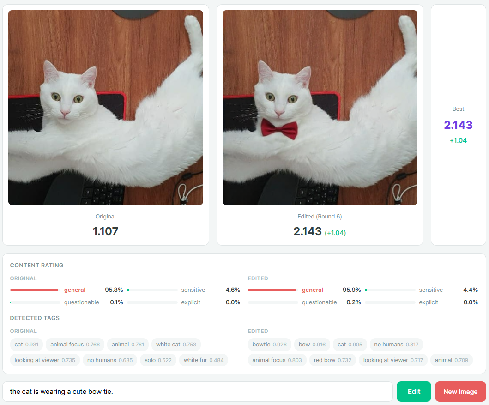
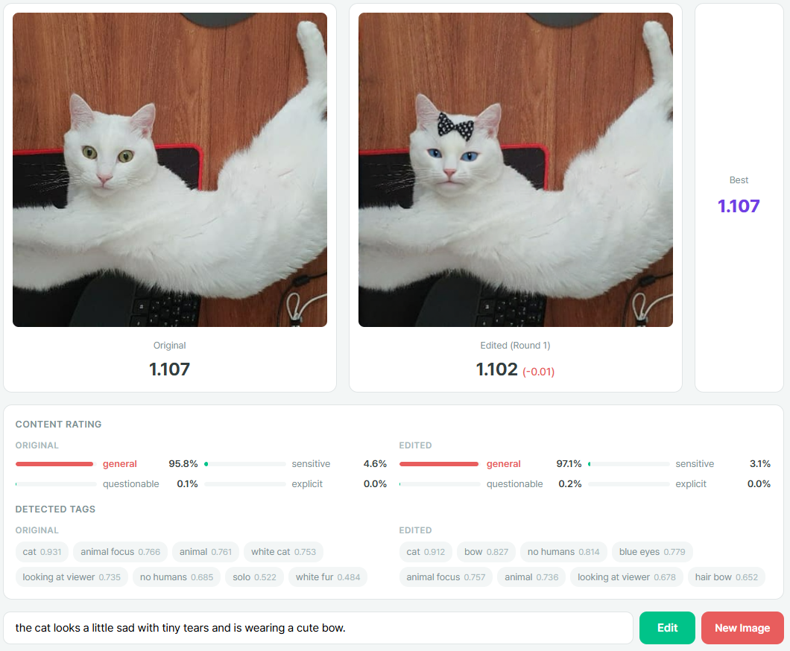

# AI Image Quality Boost Battle

**A competitive prompt-engineering game for AI-driven image enhancement.**

Upload any image, write a text prompt, and watch an AI edit your image in real time. An independent scoring model evaluates visual quality before and after. Compete on the leaderboard by achieving the highest score improvement.

All models used in this project are open-source.



## How It Works

1. **Upload** your image and enter your name.
2. **Write a prompt** describing how to enhance it (e.g., *"add dramatic lighting and vibrant sunset colors"*).
3. **ICEdit** (FLUX + MoE-LoRA) edits the image based on your prompt.
4. **HPSv3** scores visual quality. **MOAT** detects content tags and rating.
5. If the edited image's top-5 tags still overlap with the original's, the score counts toward the **leaderboard**.
6. Repeat with different prompts to climb the ranks.

### Good Example

A prompt that enhances visual quality while preserving the original content. The original top-5 tags remain in the edited result, so the score counts toward the leaderboard.



### Bad Example

A prompt that changes the image too drastically. None of the original top-5 tags survive, so the edit is flagged and excluded from the leaderboard.



## Key Features

- Multi-GPU support with async GPU pool (one ICEdit instance per GPU)
- Real-time visual quality scoring (HPSv3, Qwen2-VL backbone)
- Content tagging and rating (MOAT ONNX)
- Tag overlap validation to prevent off-topic edits
- Persistent leaderboard with per-round logging (images + prompts saved to disk)
- Single-page web UI with no build step

## Installation

### 1. Environment

```bash
python3 -m venv venv && source ./venv/bin/activate
```

### 2. PyTorch (CUDA 11.8)

```bash
pip install torch==2.7.1 torchvision==0.22.1 torchaudio==2.7.1 \
    --index-url https://download.pytorch.org/whl/cu118
```

### 3. Diffusers (ICEdit-compatible commit)

```bash
pip install git+https://github.com/huggingface/diffusers.git@e5aa719241f9b74d6700be3320a777799bfab70a
```

### 4. Dependencies

```bash
pip install transformers==4.48.3 accelerate==1.13.0 scikit-learn
pip install einops==0.8.1 numpy==1.26.4 sanghyunjo orjson peft==0.18.1
pip install sentencepiece==0.2.0 protobuf==5.27.2
pip install fastapi uvicorn[standard] python-multipart
pip install onnxruntime pandas huggingface_hub safetensors pyngrok
```

> `transformers==4.48.3` is required for compatibility with both HPSv3 and the Diffusers commit used by ICEdit.

### 5. Model Weights

Download the weights archive from Google Drive and extract it into the project root:

**[Download weights.zip using Google Drive](https://drive.google.com/file/d/1_eQ_J6M5OZ6X9LMdao7J8qe9NVWC-H9q/view?usp=sharing)**

After extraction, the structure should look like:

```
weights/
├── DanbooruMOAT.onnx              # MOAT image tagger
├── DanbooruMOAT.csv               # MOAT tag labels
└── ICEdit-MoE-LoRA.safetensors    # ICEdit MoE-LoRA adapter
```

> HPSv3 and FLUX base model weights are downloaded automatically from Hugging Face on first run.

If you place the LoRA file elsewhere, set the environment variable:

```bash
export LORA_WEIGHTS=/path/to/ICEdit-MoE-LoRA.safetensors
```

### 6. Hugging Face Authentication

Some models require authentication. Set your token:

```bash
export HF_TOKEN=hf_your_token_here
```

## Usage

```bash
# First GPU = scorer, remaining GPUs = editors
CUDA_VISIBLE_DEVICES=0,1 python3 server.py

# More GPUs = more concurrent editors
CUDA_VISIBLE_DEVICES=0,1,2,3,4 python3 server.py
```

Open `http://localhost:7960` in your browser.

To change the port:

```bash
PORT=9123 python3 server.py
```

### Public Access (ngrok tunnel)

To share a public URL without port forwarding or firewall configuration:

```bash
# One-time setup: install pyngrok and set your ngrok auth token
pip install pyngrok
ngrok config add-authtoken YOUR_NGROK_TOKEN

# Launch with public tunnel
CUDA_VISIBLE_DEVICES=0,1 python3 server.py --tunnel
```

The public URL will be printed in the terminal (e.g., `https://xxxx-xxxx.ngrok-free.app`). Anyone with the link can access the battle. Free ngrok accounts allow one tunnel at a time.

## GPU Layout

```
CUDA_VISIBLE_DEVICES=0,1,2,3,4

  cuda:0  ->  Scorer (HPSv3 + MOAT)       shared, concurrent
  cuda:1  ->  ICEdit instance #1           1 user at a time
  cuda:2  ->  ICEdit instance #2           1 user at a time
  cuda:3  ->  ICEdit instance #3           1 user at a time
  cuda:4  ->  ICEdit instance #4           1 user at a time

  = 4 concurrent editing slots
  = 60s idle timeout auto-releases GPU
```

## Leaderboard Management

All session data is stored under `./leaderboard/`:

```
leaderboard/
├── _ranking.json          <- auto-generated ranking summary
├── {session_id}/
│   ├── session.json       <- metadata (creator, scores, timestamps)
│   ├── original.png       <- uploaded original
│   ├── best.png           <- best edited result
│   ├── round_01/
│   │   ├── edited.png     <- edited image for this round
│   │   └── info.json      <- prompt, score, delta, timestamp
│   └── ...
```

| Task | Command |
|------|---------|
| Review rankings | `cat leaderboard/_ranking.json` |
| Remove one entry | `rm -rf leaderboard/{session_id}/` |
| Reset all | `rm -rf leaderboard/*/` |

The leaderboard auto-regenerates when folders are added or removed.

## Project Structure

```
├── server.py              # FastAPI backend (scoring, editing, leaderboard)
├── demo_t2i_flux1.py      # FLUX text-to-image pipeline wrapper
├── demo_inp_icedit.py     # ICEdit inpainting pipeline (MoE-LoRA)
├── core/
│   ├── diffusion/         # Diffusion pipeline builder and model registry
│   ├── hpsv3/             # HPSv3 visual quality scoring model
│   └── moat/              # MOAT image tagger (ONNX)
├── web/
│   ├── index.html         # Single-page UI
│   ├── style.css          # Styles
│   └── app.js             # Frontend logic
├── weights/               # Model weights (not in git, see Installation)
│   ├── DanbooruMOAT.onnx
│   ├── DanbooruMOAT.csv
│   └── ICEdit-MoE-LoRA.safetensors
├── resources/
│   ├── overview.png       # App screenshot
│   ├── good.png           # Good editing example
│   └── bad.png            # Bad editing example (tag mismatch)
├── LICENSE                # Apache 2.0
└── README.md
```

## Open-Source Models Used

| Model | Usage | License | Source |
|-------|-------|---------|--------|
| [FLUX.1-Fill-dev](https://huggingface.co/black-forest-labs/FLUX.1-Fill-dev) | Base inpainting backbone | [FLUX.1-dev Non-Commercial](https://huggingface.co/black-forest-labs/FLUX.1-dev/blob/main/LICENSE.md) | Black Forest Labs |
| [ICEdit](https://github.com/River-Zhang/ICEdit) | MoE-LoRA instruction-based editing | Apache 2.0 | Zhang et al., NeurIPS 2025 |
| [HPSv3](https://github.com/MizzenAI/HPSv3) | Human preference / visual quality scoring | MIT | Ma et al., ICCV 2025 |
| [MOAT](https://huggingface.co/SmilingWolf/wd-v1-4-moat-tagger-v2) | Image tagging and content rating | Apache 2.0 | Yang et al., ICLR 2023 |

## License

The **application code** in this repository is released under [Apache 2.0](LICENSE).

The **model weights** used by this project are subject to their own licenses (see table above). In particular, FLUX.1-Fill-dev is distributed under a **non-commercial license**. This project does not redistribute any model weights. Please review each model's license before use.

Copyright 2026 [Sanghyun Jo](https://shjo-april.github.io/). [GitHub](https://github.com/shjo-april/ai-image-enhancer-battle)
